## 第一章 VirtualBox的配置与使用

### 实验目的

- 熟悉基于 OpenWrt 的无线接入点（AP）配置
- 为第二章、第三章和第四章实验准备好「无线软 AP」环境

---

### 实验环境

- Virtualbox
- 可以开启监听模式、AP 模式和数据帧注入功能的 USB 无线网卡（NetGear, Inc. WNA1100 Wireless-N 150 [Atheros AR9271]）
  

---

### 实验要求

- [x] 对照第一章实验 `无线路由器/无线接入点（AP）配置` 列的功能清单，找到在 `OpenWrt` 中的配置界面并截图证明
- [x] 记录环境搭建步骤
- [x] 如果 USB 无线网卡能在 `OpenWrt` 中正常工作，则截图证明

---

### 实验过程

#### OpenWrt on VirtualBox环境搭建

1. 手动下载文件`openwrt-19.07.5-x86-64-combined-squashfs.img.gz`

2. 用git bash进行解压缩

```gunzip openwrt-x86-64-combined-squashfs.img.gz```

3. 将img 格式转换为 Virtualbox 虚拟硬盘格式 vdi并扩容

* 转换

```
VBoxManage convertfromraw --format VDI openwrt-x86-64-combined-squashfs.img openwrt-x86-64-combined-squashfs.vdi
```

* 转换过程中报错，按照bash中提示信息执行dd命令

```
dd if=openwrt-19.07.5-x86-64-combined-squashfs.img of=openwrt-19.07.5-x86-64-combined-squashfs-padded.img bs=128000 conv=sync
```

* 虚拟磁盘扩容

```
  VBoxManage modifymedium disk --resize 10240 "$VDI_BASE"
  ```

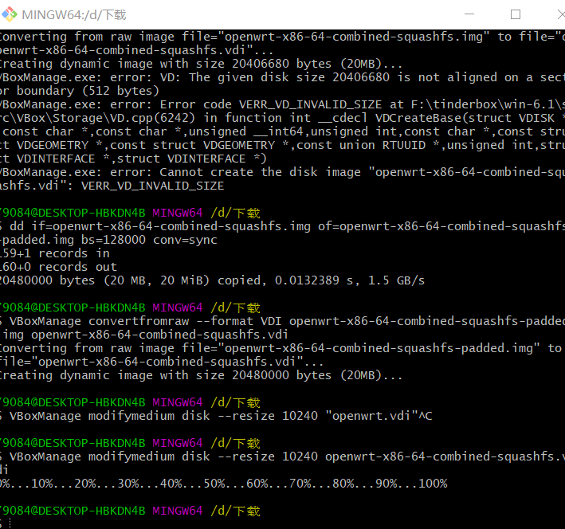


4. 虚拟机安装成功，将第一块网卡设置为：Intel PRO/1000 MT 桌面（仅主机(Host-Only)网络）；第二块网卡设置为：Intel PRO/1000 MT 桌面（网络地址转换(NAT)）

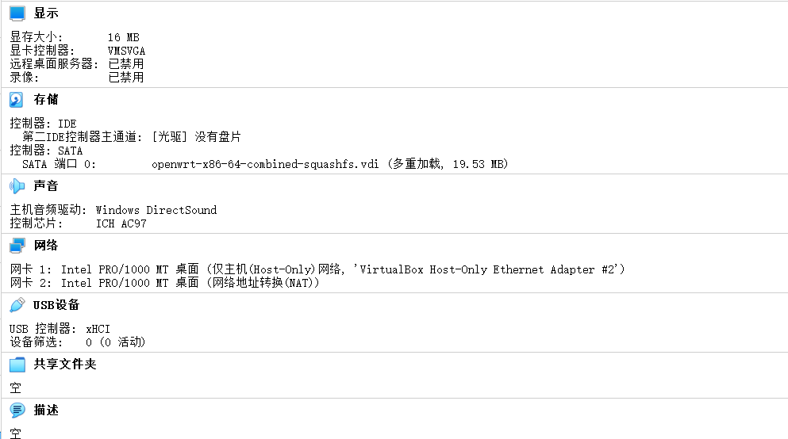

5. 启动虚拟机后，修改/etc/config/network

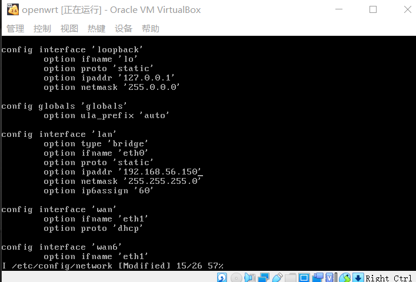

6. 修改完成后重新加载指定网卡

```
# 网卡重新加载使配置生效
ifdown eth0 && ifup eth0
# 查看网卡
ip a
```

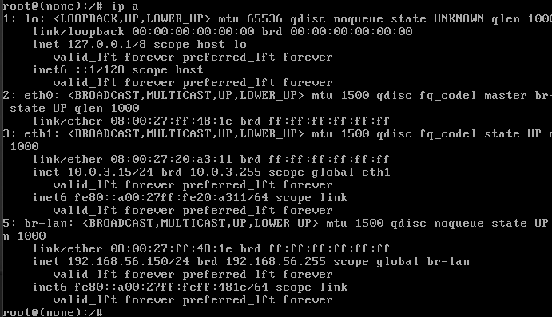

7. 通过 OpenWrt 的软件包管理器 opkg 进行联网安装软件

```# 更新 opkg 本地缓存
opkg update

# 检索指定软件包
opkg find luci
# luci - git-19.223.33685-f929298-1

# 查看 luci 依赖的软件包有哪些 
opkg depends luci
# luci depends on:
#     libc
#     uhttpd
#     uhttpd-mod-ubus
#     luci-mod-admin-full
#     luci-theme-bootstrap
#     luci-app-firewall
#     luci-proto-ppp
#     libiwinfo-lua
#     luci-proto-ipv6

# 查看系统中已安装软件包
opkg list-installed

# 安装 luci
opkg install luci

# 查看 luci-mod-admin-full 在系统上释放的文件有哪些
opkg files luci-mod-admin-full
# Package luci-mod-admin-full (git-16.018.33482-3201903-1) is installed on root and has the following files:
# /usr/lib/lua/luci/view/admin_network/wifi_status.htm
# /usr/lib/lua/luci/view/admin_system/packages.htm
# /usr/lib/lua/luci/model/cbi/admin_status/processes.lua
# /www/luci-static/resources/wireless.svg
# /usr/lib/lua/luci/model/cbi/admin_system/system.
# ...
# /usr/lib/lua/luci/view/admin_network/iface_status.htm
# /usr/lib/lua/luci/view/admin_uci/revert.htm
# /usr/lib/lua/luci/model/cbi/admin_network/proto_ahcp.lua
# /usr/lib/lua/luci/view/admin_uci/changelog.htm
```

8. 访问IP地址登录管理界面，首次不需要密码直接可登录。

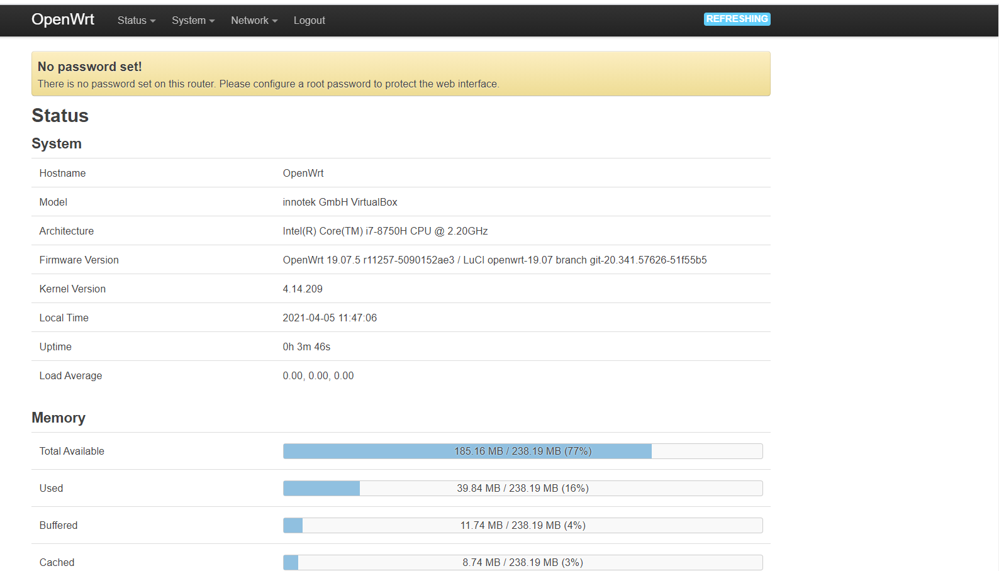

#### 开启 AP 功能

1. 当前待接入 USB 无线网卡的芯片信息可以通过在 Kali 虚拟机中使用`lsusb`的方式查看，但默认情况下 OpenWrt 并没有安装对应的软件包，需要通过如下`opkg`命令完成软件安装

```opkg update && opkg install usbutils```

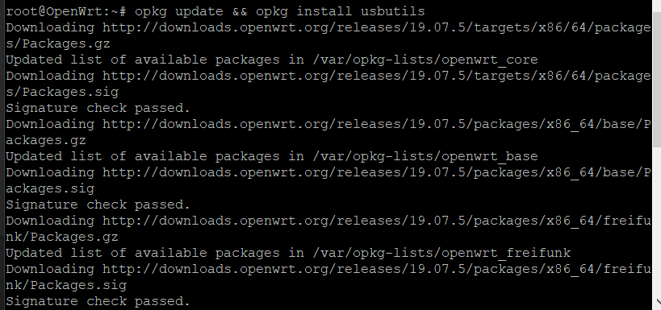

2. 安装好 usbutils 之后，通过以下 2 个步骤可以确定该无线网卡的驱动是否已经安装好。

```# 查看 USB 外设的标识信息
lsusb
# 查看 USB 外设的驱动加载情况
lsusb -t

# 若驱动未加载，则下载驱动
# opkg find 命令可以快速查找可能包含指定芯片名称的驱动程序包
opkg find kmod-* | grep 9271
#a安装驱动
opkg install kmod-ath9k-htc
```

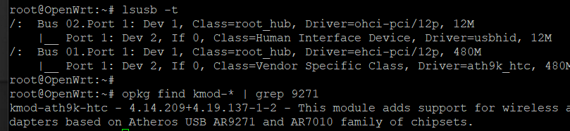

3. 默认情况下，OpenWrt 只支持 WEP 系列过时的无线安全机制。为了让 OpenWrt 支持 WPA 系列更安全的无线安全机制，还需要额外安装 2 个软件包：`wpa-supplicant` 和 `hostapd` 。其中 `wpa-supplicant` 提供 WPA 客户端认证，`hostapd` 提供 AP 或 ad-hoc 模式的 WPA 认证。

```opkg install hostapd wpa-supplicant```

4. 成功加载网卡驱动后，登入 LuCi 之后在顶部菜单 Network 里即可发现新增了一个菜单项 Wireless

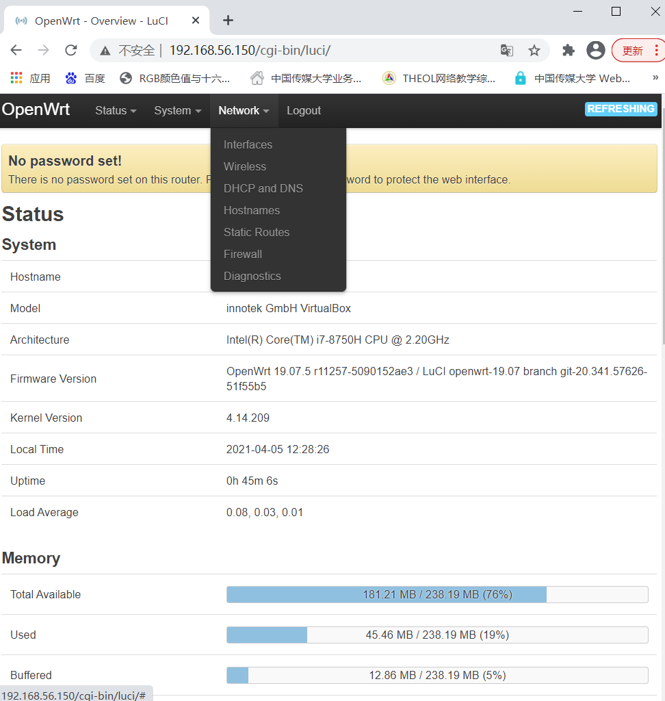

5. 配置无线网卡时，不要使用 Auto 模式的信道选择和信号强度，均手工指定才可以。如下图所示为手工指定监听信道和信号强度的示例：

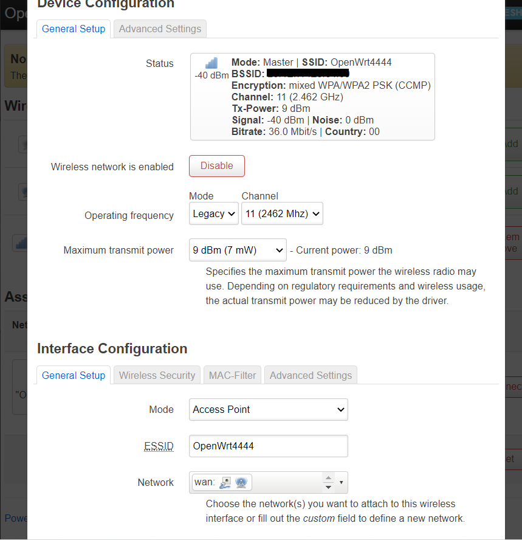

6. 无设备连接情况：

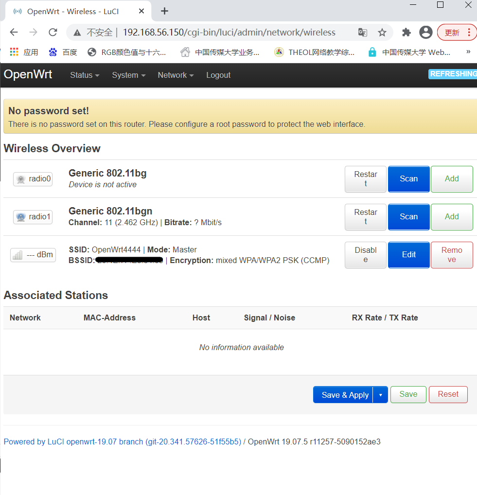

7. 一台设备连接

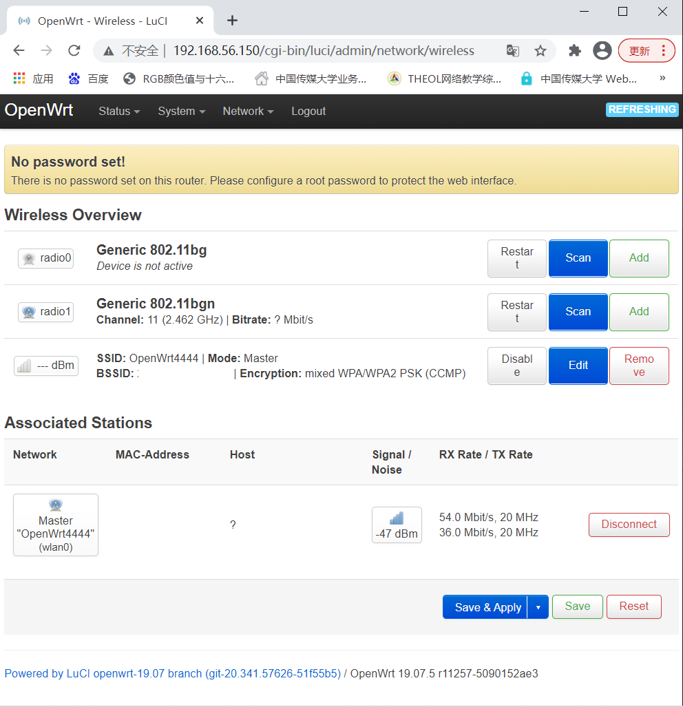

8. 配置不同的加密方式

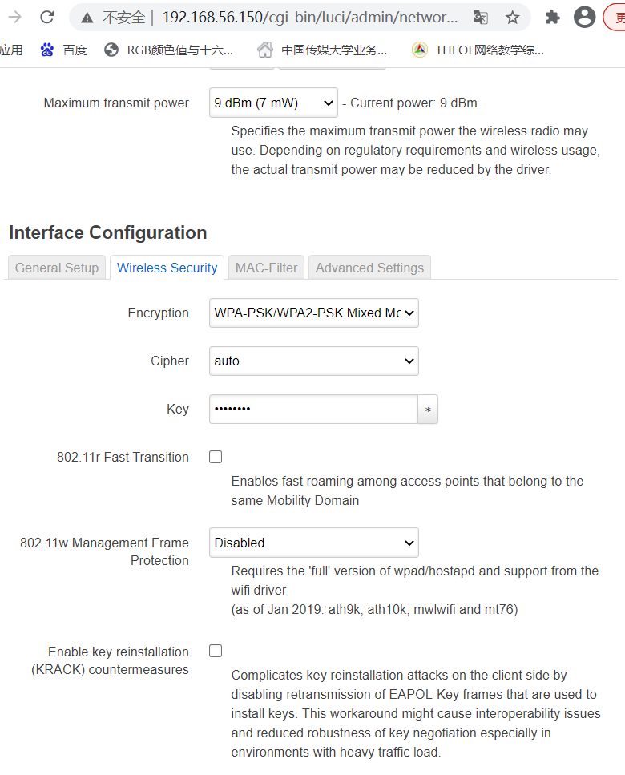

9. 通过该网卡扫描周围的wifi情况：

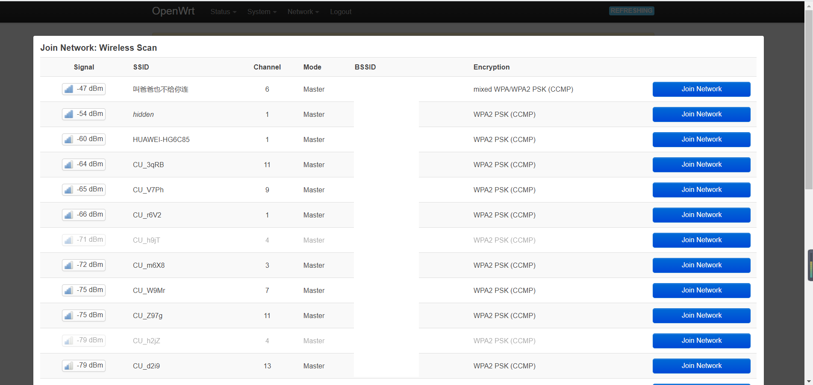

---

### 实验问题

* 在VirtualBox目录下VBoxManage命令不能使用，VBoxManage.exe是有的。上网查说可能是路径里Program Files有空格的原因（但是这里好像和空格又没什么关系。。。。），反正把路径添加到环境变量之后它就好了。

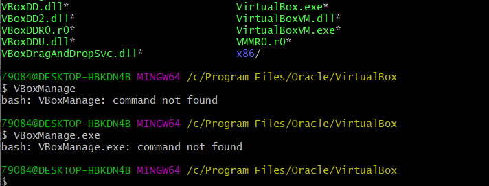

* 这块网卡要用USB2.0的控制器，用USB3.0的话无线网络启不起来。

### 参考资料

[移动互联网安全第一章实验](https://c4pr1c3.github.io/cuc-mis/chap0x01/exp.html)

[AlinaZxy的第一章实验报告](github.com/CUCCS/2021-mis-public-AlinaZxy/blob/Chap01/chap01/chap01.md)

[shiancuc的第一章实验报告](https://github.com/CUCCS/2021-mis-public-shiancuc/blob/mis_chap0x01/chap0x01/mis_chap0x01_report.md)
