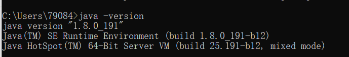
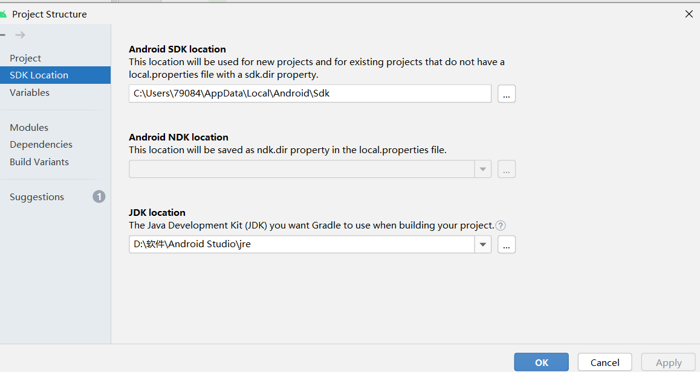
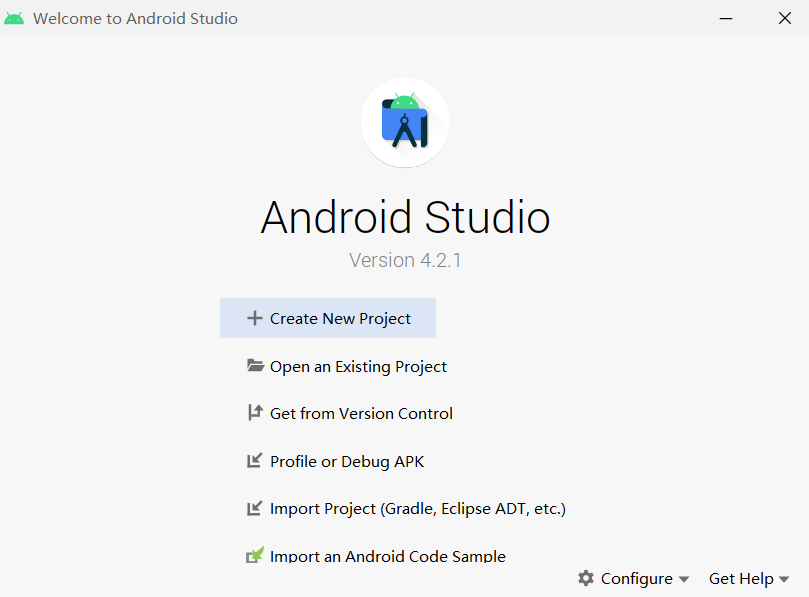
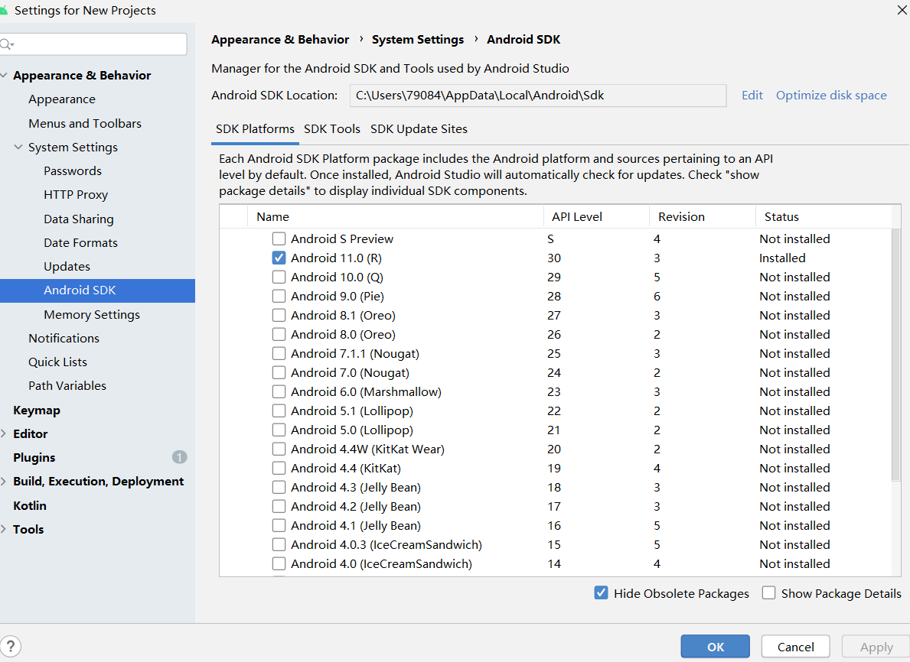
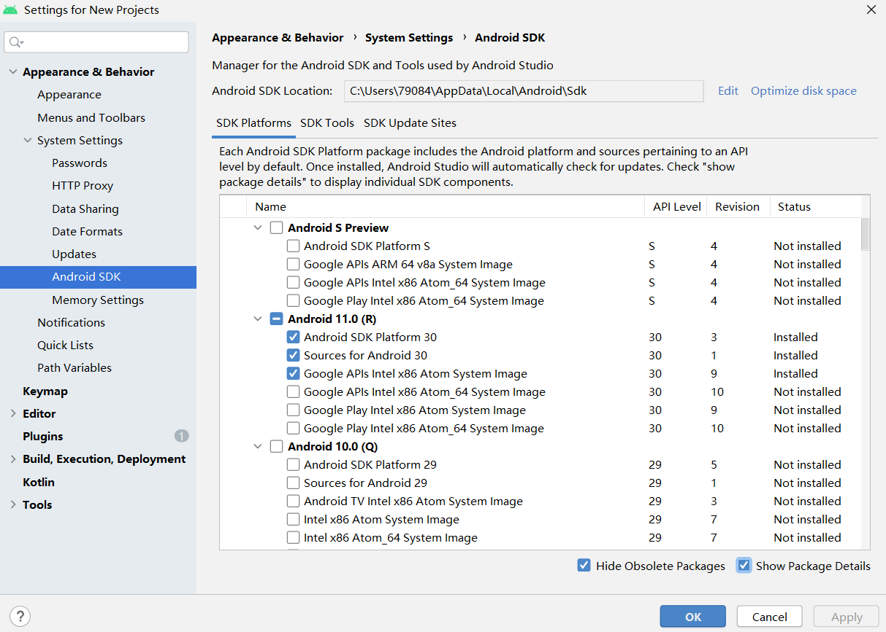
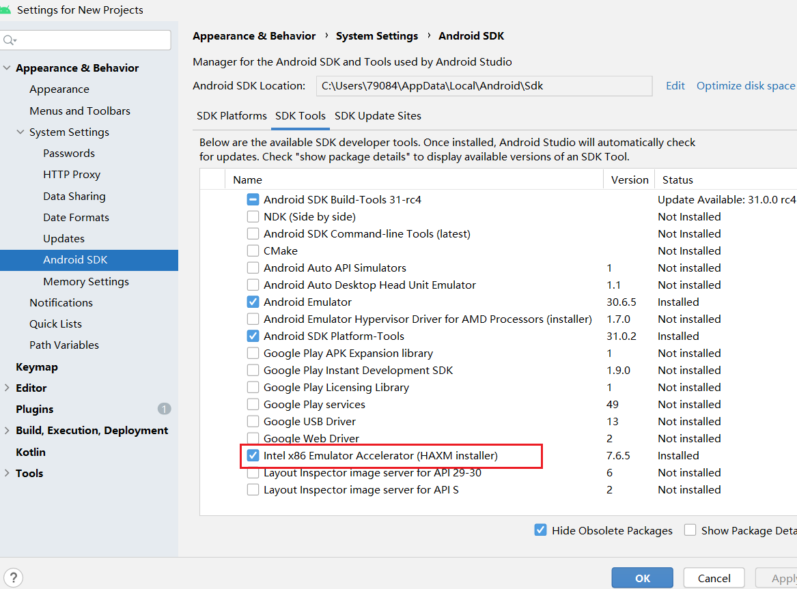
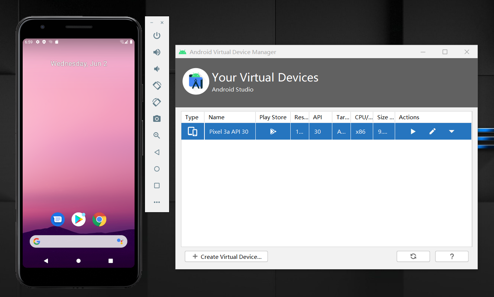
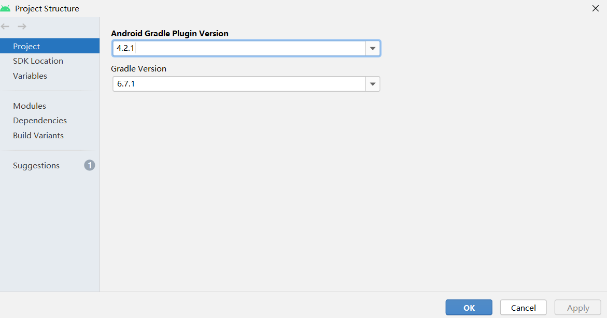

# 第五章 Android Studio模拟器环境搭建

---

## 实验要求

- [x] 安装和配置 Java SDK
- [x] 安装Android Studio
- [x] 下载安装 Android SDK
- [x] 配置 Android 模拟器运行环境
- [x] 配置 Gradle 编译环境

---

## 实验环境

* Windows 10

* Android Studio 4.2.1 for Windows 64-bit

---

## 实验过程

### 安装和配置 Java SDK

* 以前安装过，检验：

* Android Studio 安装后已经内置了 Java 运行时环境，通过菜单 File -> Project Structure -> SDK Location 可以查看到 JDK 目录。

### 安装Android Studio

* [下载Android Studio](https://developer.android.google.cn/studio)

* 安装完成后启动

### 下载安装 Android SDK

* 点击 Configure -> SDK Manager 启动 SDK Manager 。

* SDK Manager 的 SDK Platforms 选项卡可以选择不同版本的 SDK 下载安装，这里已经默认安装好Android 11.0。

* 在 SDK Platforms 选项卡中勾选 Show Package Details 可以进一步定制下载哪些系统组件。

### 配置 Android 模拟器运行环境

* 安装 Intel x86 Emulator Accelerator (HAXM installer)（打开SDK Tools就发现已经自己装好啦）

* 模拟器运行情况

### 配置 Gradle 编译环境

* 使用 Android Studio 的内置 gradle，插件版本信息：

---

## 实验问题

* [Android Studio下载链接](https://developer.android.com/studio/)死活打不开，上网搜索说是将https://developer.android.com/改成https://developer.android.google.cn/，改了之后确实可以访问啦~

---

## 参考资料

* [移动互联网安全第五章实验](https://c4pr1c3.github.io/cuc-mis/chap0x05/exp.html)

* [关于https://developer.android.com/国内无法访问解决办法](https://blog.csdn.net/anything14/article/details/89841392)

