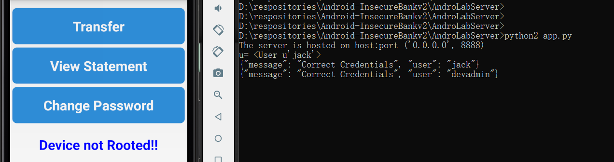
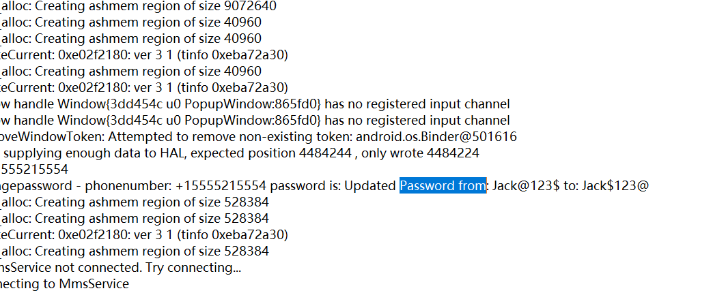
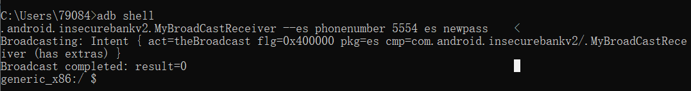

# 实验八 Android 缺陷应用漏洞攻击实验

## 实验目的

- 理解 Android 经典的组件安全和数据安全相关代码缺陷原理和漏洞利用方法

- 掌握 Android 模拟器运行环境搭建和 `ADB` 使用

## 实验环境

- Android-InsecureBankv2

- Android Studio

- Python 2.7

## 实验要求

- [x] 详细记录实验环境搭建过程；

- [x] 至少完成以下实验：

    - [x] Developer Backdoor
    - [x] Insecure Logging
    - [x] Android Application patching + Weak Auth
    - [x] Exploiting Android Broadcast Receivers
    - [x] Exploiting Android Content Provider

## 实验过程

### 搭建InsecureBankv2环境

- 使用的Python环境

    

- 从[InsecureBankv2](https://github.com/c4pr1c3/Android-InsecureBankv2)下载代码

- `pip install -r requirements.txt` 安装必备软件

    

- `python app.py` 尝试运行服务器

    

- `db install InsecureBankv2.apk` 在ADV上安装APK

    

- 进行已知用户名密码登录尝试

    

### Developer Backdoor

- 根据老师课上视频相关演示，找到如下代码，从而得知后门账户为 Devadmin

    

- 使用后门账户时，密码任意即可登录

    

- 登陆成功

    

### Insecure Logging

- `adb logcat > 1.txt` 抓取Jack登录日志

    

- 分析日志

    

- 尝试更改密码操作

    

- 查看日志，找到更改密码的记录

    

### Android Application patching + Weak Auth

- VS Code安装APKlab扩展实现解码

    

- 更改`res/values/strings.xml`配置

    

- 重新编译生成APK文件

    

- 重新安装 `InsecureBankv2.apk` ，界面如下，增加了一个添加用户的功能

    

### Exploiting Android Broadcast Receivers

- 查看反编译后的`AndroidManifest.xml`

    

- 解压缩`InsecureBankv2.apk`

    

- 将`classes.dex`移至`dex2jar`

- `d2j-dex2jar.bat classes.dex` 完成格式转换

    

- 使用JADX-GUI打开`classes-dex2jar.jar`文件，查找对应源代码

    

    

- `adb shell`执行命令`am broadcast -a theBroadcast -n com.android.insecurebankv2/com.android.insecurebankv2.MyBroadCastReceiver --es phonenumber 5554 –es newpass`

    

### Exploiting Android Content Provider

- 使用`jack/Jack@123$`多次登录

- 查看反编译后的AndroidManifest.xml

    

- 使用JADX-GUI打开`classes-dex2jar.jar`文件，查找对应源代码

    

- `adb shell`执行命令`content query --uri content://com.android.insecurebankv2.TrackUserContentProvider/trackerusers`

    

## 实验问题

- 执行`pipenv install -r requirements.txt --two`报错，查看`pipenv --version`发现是2018版的，就重装了一遍pip，可是2021版的也报错：

    

解决办法：看见欣怡没有用pipenv而是直接用的pip，使用`pip install -r requirements.txt`就好啦。

## 参考资料

- [移动互联网安全（2021）](https://www.bilibili.com/video/BV1rr4y1A7nz?p=162)

- [第八章课后作业](https://c4pr1c3.github.io/cuc-mis/chap0x08/homework.html)

- [AlinaZxy的chap08实验报告](https://github.com/CUCCS/2021-mis-public-AlinaZxy/tree/Chap08/chap08)

- [shiancuc的chap0x08实验报告](https://github.com/CUCCS/2021-mis-public-shiancuc/blob/mis_chap0x08/chap0x08/README.md)